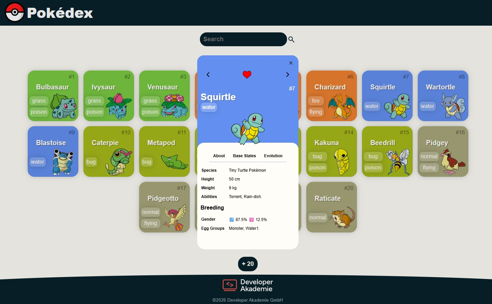

# Pokédex

A responsive Pokédex web app built with vanilla HTML, CSS and JavaScript. It loads Pokémon data from the [PokéAPI](https://pokeapi.co/) and shows each Pokémon as a card colored by its type, with a detail dialog for stats, breeding info and evolutions.

Built as a project for the [Developer Akademie](https://developerakademie.com/).



## Features

- **Pokémon cards** – name, ID, types and artwork, with the background color based on the primary type.
- **Load more** – fetches the first 20 Pokémon on start, and the `+ 20` button loads the next 20.
- **Search** – filters loaded Pokémon by name (at least 3 letters).
- **Detail dialog** with three tabs:
  - **About** – species, height, weight, abilities, gender ratio and egg groups
  - **Base States** – HP, Attack, Defense, Sp. Attack, Sp. Defense, Speed and Total, with progress bars
  - **Evolution** – the Pokémon's evolution chain
- **Navigation** – browse to the previous/next Pokémon inside the dialog (wraps around at the ends).
- **Favorites** – mark a Pokémon with a heart (kept for the current session).
- **Loading spinner** while data is being fetched.

## Tech Stack

- HTML5 (including the native `<dialog>` element)
- CSS3
- JavaScript (ES6+, `async`/`await`, `fetch`, `Promise.all`)
- [PokéAPI](https://pokeapi.co/) – REST API for Pokémon data

## Getting Started

No build step or dependencies are needed.

1. Clone the repository:
   ```bash
   git clone <repository-url>
   cd Pokedex
   ```
2. Open `index.html` in your browser, or serve the folder with a local server (e.g. the VS Code **Live Server** extension).

An internet connection is required, because all Pokémon data and images are loaded from the PokéAPI.

## Project Structure

```
Pokedex/
├── index.html            # Page layout and detail dialog
├── script.js             # Data fetching, rendering, search, dialog logic
├── style.css             # Main styles
├── scripts/
│   └── templates.js      # HTML templates for cards, types and evolutions
├── styles/
│   ├── standard.css      # Base styles
│   └── dialog.css        # Detail dialog styles
└── assets/
    ├── icons/            # Heart icons
    └── images/           # Favicon and screenshot
```

## Credits

- Pokémon data and sprites: [PokéAPI](https://pokeapi.co/)
- Pokémon and Pokémon names are trademarks of Nintendo, Game Freak and The Pokémon Company. This is a non-commercial learning project.
